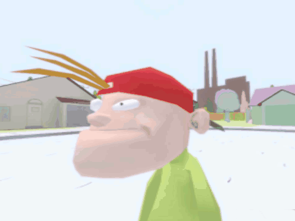

I have watched quite a few anime and read a bunch of manga in my 4 years of being an adult and the amount of valuable titles are countable on one hand.

- Mob Psycho 100
- WataMote
- Nichijou

There are a few other good ones but they're not _valuable_, meaning I don't think they have influenced my life significantly. There's also a bunch of boring stuff that nobody cares about and is just meaningless [CGDCT](https://www.urbandictionary.com/define.php?term=CGDCT). However, there's a number of titles that make me want to set fire to Japan. For some unholy reason, there's a lot of gross pedo shit involved in some of these. Why? Why would you do that? Iedereen die hieraan heeft gewerkt en deze dingen leuk vind moet een smeer op het asfalt worden. Ga heen met je ranzige troepzooi, ik hoop dat je je stemrecht verliest. Je stinkt een uur in de wind.

